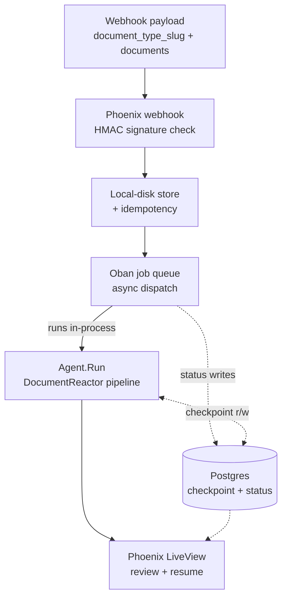
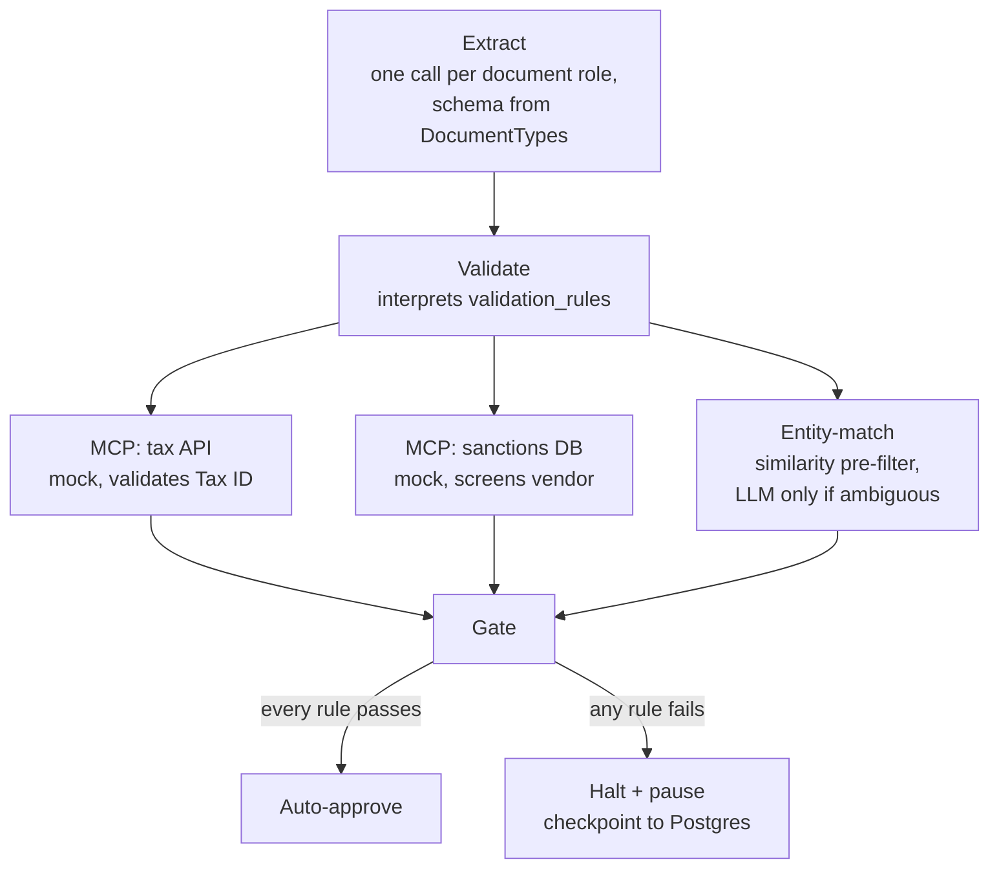
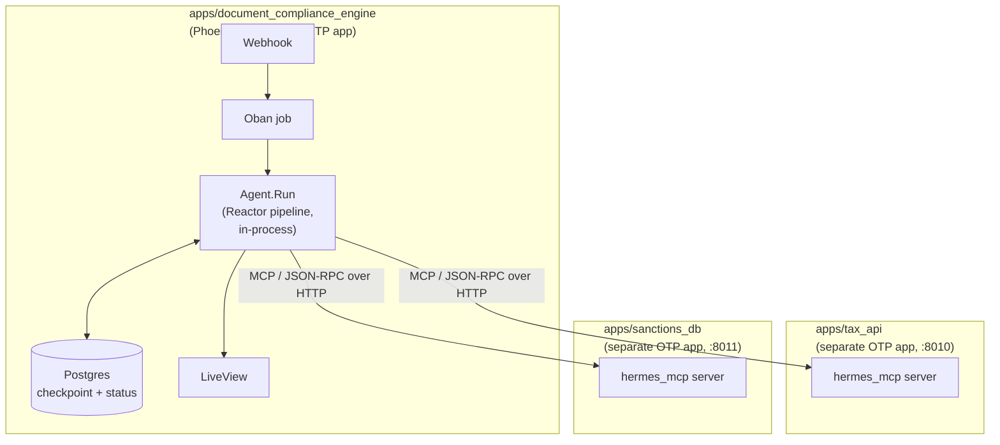

# Agentic Document Compliance Engine

A back-office automation system that ingests one or more documents for a given document type, extracts structured data with an LLM, cross-validates it against external systems via MCP tools, and routes discrepancies to a human reviewer — with a durable, resumable pause instead of a dropped thread. Started as a vendor-onboarding-specific pipeline (a contract + a W-9); both the ingestion data model and the agent pipeline itself are now genuinely document-type-generic, proven against two structurally different real document types — the original contract-plus-W9 bundle and a single-document invoice — not just reshaped config.

## The business problem

Vendor onboarding is a high-volume, compliance-sensitive back-office process: someone has to read a contract and a tax form, key the data into a system, check the Tax ID against a government registry, screen the vendor against a sanctions list, and catch it when the name on the tax form doesn't match the name on the contract. Two common approaches both fall short. Doing it manually is slow and error-prone. Doing it with a naive LLM pipeline is fast, but trades that error-proneness for something worse: no audit trail, no way to prove it isn't hallucinating facts, and no resumable path when something needs a human — it's fast right up until it's confidently wrong in a way nobody can catch or recover from.

This project builds the middle ground: an agentic pipeline that automates extraction and validation, but treats every extracted fact as something that must be checked against a source before it acts on it, and treats every ambiguous case as something that must stop and wait for a person — durably. A document type is now config (which fields to extract, which rules to validate against), not code, so the same pipeline generalizes past the original vendor-onboarding case.

## Architecture

**System overview** — one Phoenix release: Oban's job process is the async
boundary between the web/LiveView side and the agent pipeline (a plain
module tree, not a separate service), Postgres is the shared source of
truth for both status and workflow checkpoints:



**Agent workflow detail** — what runs inside `DocumentComplianceEngine.Agent.DocumentReactor` on each trigger. Both steps are document-type-generic: extraction fields and validation rules come from the triggering job's `DocumentTypes` row, not a hardcoded shape:



**Deployment topology** — three OTP applications, not four and not one. The
agent brain lives *inside* the Phoenix release (see "why this shape" below);
the two mock tools stay genuinely separate processes, because faking that
boundary away would make the MCP framing decorative rather than real. All
three live as equal siblings under `apps/` (a Mix umbrella for directory
clarity only — each keeps its own deps/build/config, see Local development):



### Why this shape, specifically

- **Phoenix does not run the agent pipeline on the request process.** A webhook handler blocking on a multi-minute agent run is a request-timeout waiting to happen. Phoenix enqueues an Oban job; the job process runs the pipeline to completion and writes the result back — Oban's own supervision is what keeps a pipeline crash from ever touching the web/LiveView side, no separate deployable required for that isolation. (An earlier pass built the agent brain as a genuinely separate OTP application talking over HTTP; collapsed back into one release once it was clear the HTTP hop was only buying independent-deploy/scale properties this project doesn't need — see `CONTEXT.md`'s dated entries.)
- **Document types are config, not code.** `DocumentTypes.extraction_schema`/`validation_rules` (JSON in Postgres) drive `Extraction.extract_all/2` and `Checks.validate_all/2` at runtime — Instructor's schemaless Ecto response models make a runtime-configured extraction shape possible without generating an Ecto module per document type. Adding a new document type is a data migration, not a reactor code change: proven, not just designed, by a second, structurally different type (`invoice` — one document, no entity-match, a single sanctions-screen rule) running through the exact same `DocumentReactor` as the original two-document contract+W-9 case.
- **The HITL pause is backed by a Postgres-persisted checkpoint**, not in-memory state. If the app restarts mid-review, the paused workflow survives — verified by killing and restarting the whole node with a paused case in flight, not assumed. The `thread_id` for a paused run is stored on the `agent_runs` row so a human approving in LiveView can trigger a resume. The checkpoint table lives in its own Postgres schema (`agent_checkpoints`), owned by its own migration prefix rather than mixed into the business-domain tables, even though it shares the same Ecto Repo now.
- **MCP is used deliberately, not decoratively.** The mock Tax API and mock Sanctions DB are two real, separate OTP applications each exposing an MCP tool interface over HTTP, not two functions folded into one process — because MCP's value is standardizing tool access across processes, and the README should be honest that for exactly two fixed mock tools, plain function-calling would work identically. The MCP framing is there because it's the pattern that scales to N real tools, and that's the argument to make explicit, not assume.
- **Idempotency and PII are first-class, not afterthoughts.** The webhook computes an idempotency key (hash of raw payload) so a duplicated submission doesn't double-process a document bundle. Tax ID is stored via an encrypted Ecto type (`Cloak`) on its own dedicated column — and stays there deliberately: the generic `extracted_fields` column added for document types with no dedicated columns of their own (today, `invoice`) never receives PII, by construction, not by convention.
- **The webhook is signature-verified, not just idempotency-checked.** `POST /webhooks/document_compliance_engine` requires an `x-webhook-signature: sha256=<hex>` header — an HMAC-SHA256 over the exact raw body bytes, checked with a constant-time compare (`DocumentComplianceEngineWeb.Plugs.VerifyWebhookSignature`). Idempotency alone stops duplicate processing of a *legitimate* payload; it does nothing to stop an unauthenticated caller from injecting a fabricated one, which is the actual threat model for an internet-facing ingestion endpoint on a compliance-pitched system.
- **Not every field is worth an LLM call.** `Checks.entity_match/2` runs a cheap `String.jaro_distance/2` pre-filter before ever calling the LLM, and `Extraction` resolves `tax_id` via regex (`\d{2}-\d{7}`) when it appears exactly once in the source text — both skip the LLM entirely for the clear-cut cases and fall through to it only for genuine ambiguity. This isn't a hunch: the entity-match thresholds are calibrated against this project's own 20 eval fixtures (a real, verified gap between the "formatting difference" and "genuine mismatch" buckets), and the regex-vs-LLM tradeoff for a rigidly-formatted field like an EIN is backed by published research showing near-identical accuracy at a large fraction of the cost — see `CONTEXT.md`'s dated entry for the sources and the full calibration data.

## Evaluation

The core resume claim — "0% hallucination rate on extracted entities" — is only credible if it's backed by the right kind of check. This project uses a **two-tier eval**, not LLM-as-judge for everything:

1. **Deterministic checks** (no LLM, fast, free): does the extracted Tax ID exist verbatim in the source document text? Does the model's output conform to the document type's `extraction_schema` (enforced by Instructor's schemaless-changeset validation)? These produce the hallucination-rate number.
2. **LLM-as-judge checks** (for genuinely ambiguous judgment): does the entity mapping in the extraction hold up under formatting differences ("J. Smith" vs "John Smith")? Is the agent's drafted mismatch explanation actually grounded in the real discrepancy? The judge model (Claude Sonnet) is a different provider than the agent model (GPT-4o-mini), to avoid self-grading inflation.

**Synthetic test set (55 documents), structured deliberately** — grown from an original 20 (10/5/3/2) specifically so the two thinnest buckets aren't one failure away from a meaningless swing:

| Bucket | Count | Tests |
|---|---|---|
| Clean, should auto-approve | 20 | happy path |
| Genuine name/entity mismatch | 15 | true-positive flagging |
| Subtle formatting difference, not a real mismatch | 12 | false-positive rate — the detail that makes "100% accuracy" credible rather than cherry-picked |
| Missing/malformed fields | 8 | graceful degradation |

This fixture set is specific to the `vendor_contract_w9` document type (the contract-vs-W-9 name-mismatch scenario) — `invoice` has no eval fixtures yet, and its own end-to-end correctness is proven by the ExUnit test suite, not the eval harness. Even at 55 cases this isn't benchmark-scale — a couple of buckets are still small enough that a single failure is visible in the headline number — but it's past the point where the numbers were mostly noise; see CONTEXT.md's dated entry for the sizing rationale.

**Results, run for real** (`mix eval.run`, both API keys configured, both mock MCP servers running):

| Bucket | Decision accuracy |
|---|---|
| Clean | 20/20 |
| Genuine mismatch | 15/15 |
| Formatting (false-positive control) | 12/12 |
| Malformed | 8/8 |

LLM-judge tier (Claude Sonnet, scoring the GPT-4o-mini agent's own judgments — cross-provider, not self-grading): entity-match correctness averaged **1.00** (n=47, every fixture with a known expected match/mismatch), groundedness of drafted mismatch explanations averaged **1.00** (n=14, out of 15 mismatch-bucket fixtures — one judge call hit a transient `Req.TransportError{reason: :timeout}` and was correctly recorded as a surfaced error rather than silently dropped or retried).

An earlier 20-fixture run once reported groundedness as `n=4` instead of the expected `n=5` — `judge_scores/1` used to silently drop a failed judge call from the average rather than count it, so the gap wasn't visible until it was made to surface failures explicitly. That dropped call turned out to be a real parsing bug, not a flaky network error: Claude's extended-thinking responses put a `type: "thinking"` block ahead of the `type: "text"` block in the response, and `Judge.extract_text/1` assumed the first content block was always the answer. Fixed to search for the actual `text` block instead of assuming its position — see `CONTEXT.md`'s dated entry for the full story, including why an eval harness silently hiding its own failures is exactly the failure mode this whole project is built to catch on the agent side.

## Tech stack

- **Elixir / Phoenix / LiveView** — webhook ingestion, Oban job orchestration, human review UI, PubSub status updates, and the agent pipeline itself — one release
- **Ecto / PostgreSQL** — the `document_jobs`/`agent_runs`/`document_types` tables, plus the agent pipeline's checkpoint table (same Repo, separate Postgres schema via a migration prefix)
- **Bandit** — the Phoenix endpoint, and the transport for both MCP tool servers
- **Reactor** — the agent pipeline as dependency-resolved steps, with `{:halt, …}` + a persisted checkpoint for the durable HITL pause
- **Instructor** — structured LLM output via schemaless Ecto response models (`%{field: :type}`, no compiled schema module) built at runtime from each document type's `extraction_schema`, so extraction fields vary by document type instead of one hardcoded shape
- **MCP** (`hermes_mcp` servers, JSON-RPC-over-HTTP client on Req) — two mock tool servers (Tax API, Sanctions DB), each a real separate OTP application, consumed by the validation agent
- **Eval harness** (`mix eval.run`) — two-tier evaluation (deterministic + LLM-as-judge; agents on GPT-4o-mini, judge on Claude Sonnet via the Anthropic Messages API)
- **GitHub Actions** (`.github/workflows/ci.yml`) — `mix precommit` on every push/PR for the Phoenix app plus each of the two MCP server apps (`mix dialyzer` deliberately left out for now — see Status)

## Status

All-Elixir today — one Mix umbrella, three independent OTP applications (`document_compliance_engine`, `tax_api`, `sanctions_db`). The agent brain started as a Python/FastAPI + LangGraph service and was migrated to Elixir component-for-component (LangGraph's `interrupt()` → Reactor's halt/resume, Pydantic → Ecto schemaless response models, DeepEval → a hand-rolled cross-provider judge, all built against a wire contract that didn't require a single change to the Phoenix app's own code). The full migration story — including the three findings that made it a real port rather than a rewrite, and every dated decision since — lives in `CONTEXT.md`, not repeated here.

The pipeline is document-type-generic, proven against two real, structurally different document types running through the same `DocumentReactor`:

| Document type | Documents | Validation rules |
|---|---|---|
| `vendor_contract_w9` | contract + W-9 | entity-match (contract vs. W-9 name, staged) + Tax ID check (regex-first) + sanctions screen |
| `invoice` | invoice only | sanctions screen only |

**Current state:**

- 142 Elixir tests in the Phoenix app (control plane + agent pipeline, one suite) + 6 across the two MCP servers, `mix precommit` clean in each of the three apps independently.
- Real PDF text extraction: `PdfText` detects a PDF by its magic-number header and runs it through `pdftotext` before extraction — text-layer PDFs only, no OCR yet. Both the webhook and the dashboard's upload form accept `.pdf` now, not just `.txt`.
- Entity-match and Tax ID extraction are staged, not always-LLM: a calibrated string-similarity pre-filter resolves clear entity matches/mismatches without a call, and Tax ID resolves via regex when the EIN pattern is unambiguous in the source text — both fall through to the LLM only when genuinely ambiguous, never guess. See "Why this shape" above and `CONTEXT.md` for the research and calibration behind the thresholds.
- `mix dialyzer` clean except 4 known, pre-existing errors — 2 `Mix.Task` callback-info warnings in `lib/mix/tasks/eval.run.ex`, 2 `guard_fail`s on a defensive `|| %{}` fallback that Reactor's own types prove unreachable — deliberately not wired into CI yet (see `CLAUDE.md`'s Pre-commit section).
- Every LLM call (both extractions, entity-match, explanation-drafting, and the eval judge) is dependency-injected and overridable via `Application.get_env(:document_compliance_engine, :agent_*)`, so the ExUnit test suite (this project's correctness guarantee, run on every `mix precommit`) always uses injected fakes plus the two *real* MCP servers and the *real* Postgres checkpointer — never a live model call, by design, regardless of whether API keys happen to be configured locally. The eval harness is separate: `mix eval.run` has now been run for real, with both API keys and both MCP servers live — see the Evaluation section above for the results, and for the real bug that surfaced along the way.
- The durable-pause guarantee (a paused review surviving a killed-and-restarted process, mid-review) and the resume-doesn't-re-extract guarantee have both been re-verified against the current, generalized reactor — not just inherited from the pre-generalization implementation.
- Both document types were also verified against a real running server (not just the test suite): POSTed over real HTTP with a valid HMAC signature, correctly land on `document_jobs` with the right `document_type_slug`, and — with no `OPENAI_API_KEY` present — fail gracefully at extraction rather than hanging in `:processing`, for both document shapes.

**PDF text extraction:** `DocumentComplianceEngine.PdfText` detects a PDF by its `%PDF-` magic-number header and runs it through `pdftotext` (poppler-utils — `brew install poppler`, a real system dependency, not bundled) before anything reaches the extraction prompt; anything else (every eval fixture, a `.txt` upload) is treated as already-plain-text and passed through unchanged. **Known limitation:** this only handles PDFs with a real text layer — a scanned/image-only PDF has no text layer for `pdftotext` to find, and OCR on top of this remains real, separate, currently-unscoped work. See `CONTEXT.md`'s dated entry.

Full dated build history and every architectural decision, with rationale, lives in `CONTEXT.md`.

## Local development

The repo root is a Mix umbrella (`apps/document_compliance_engine`, `apps/tax_api`,
`apps/sanctions_db`) for directory clarity only — each app is fully
independent (own deps, own build, own config). **Always `cd` into the
specific app first; never run `mix` commands from the repo root** — see
`CLAUDE.md`'s "Architecture in one paragraph" for why a root-level command
doesn't do what you'd expect here.

* `cd apps/document_compliance_engine && mix setup` to install dependencies and run migrations (includes the agent pipeline's checkpoint table, in its own `agent_checkpoints` schema, and seeds both document types: `vendor_contract_w9`, `invoice`)
* `brew install poppler` (or your platform's equivalent) for `pdftotext` — only needed to actually process a real PDF (uploading one, or a webhook payload containing one); not required for `mix test`, which fakes the PDF-extraction step like every other external call
* Set `OPENAI_API_KEY` (agents) and `ANTHROPIC_API_KEY` (LLM judge) to run the real LLM calls (neither is required to run the test suite — it uses injected fakes). Either export them in your shell, or `cp .env.example .env` and fill in real values — `.env` is gitignored and auto-loaded by `config/config.exs` (a real exported shell var always takes priority over it)
* Start Phoenix with `mix phx.server` or inside IEx with `iex -S mix phx.server` (from `apps/document_compliance_engine`)
* Visit [`localhost:4000`](http://localhost:4000)
* Webhook requests must be HMAC-SHA256 signed (`x-webhook-signature: sha256=<hex>` over the raw body) and carry a `document_type_slug` plus a `documents` map keyed by the roles that type's `extraction_schema` expects. Dev uses the fixed secret in `apps/document_compliance_engine/config/dev.exs`; sign a local curl request with:

  ```sh
  SECRET="dev-only-webhook-secret-change-me"

  # vendor_contract_w9 — two documents
  BODY='{"document_type_slug":"vendor_contract_w9","documents":{"contract":"'"$(echo -n 'contract text' | base64)"'","w9":"'"$(echo -n 'w9 text' | base64)"'"}}'
  SIG=$(printf '%s' "$BODY" | openssl dgst -sha256 -hmac "$SECRET" | sed 's/^.* //')
  curl -X POST localhost:4000/webhooks/document_compliance_engine \
    -H "content-type: application/json" -H "x-webhook-signature: sha256=$SIG" -d "$BODY"

  # invoice — one document
  BODY='{"document_type_slug":"invoice","documents":{"invoice":"'"$(echo -n 'invoice text' | base64)"'"}}'
  SIG=$(printf '%s' "$BODY" | openssl dgst -sha256 -hmac "$SECRET" | sed 's/^.* //')
  curl -X POST localhost:4000/webhooks/document_compliance_engine \
    -H "content-type: application/json" -H "x-webhook-signature: sha256=$SIG" -d "$BODY"
  ```

  Two lighter-weight alternatives to hand-signing curl requests:
  - `mix webhook.send <fixture_id>` (e.g. `mix webhook.send clean-01`) signs and posts one of the eval harness's 55 fixtures against a running `mix phx.server`
  - The dashboard itself (`/document_jobs`) has a "Submit a document" form — file upload, calls the same `DocumentJobs.ingest_webhook/1` the real webhook hits (just without the HMAC step, since it's a trusted in-process LiveView action, not an untrusted network caller). `.txt` or `.pdf` (text-layer PDFs only, via `PdfText` — see "PDF text extraction" above; no OCR yet for a scanned/image PDF).

The two mock MCP tool servers are still separate OTP applications — genuinely external tools, not part of the agent pipeline — and run alongside Phoenix during local development:

* `cd apps/tax_api && mix deps.get && iex -S mix` — mock Tax API MCP server, port 8010
* `cd apps/sanctions_db && mix deps.get && iex -S mix` — mock Sanctions DB MCP server, port 8011
* `mix test` from inside each app's own directory (likewise `cd apps/tax_api && mix test`, etc.)
* `mix eval.run` (from `apps/document_compliance_engine`) — the eval harness; the deterministic tier needs `OPENAI_API_KEY` (+ the two MCP servers running), the LLM-judge tier also needs `ANTHROPIC_API_KEY`. Currently only exercises `vendor_contract_w9` — see Evaluation above.
