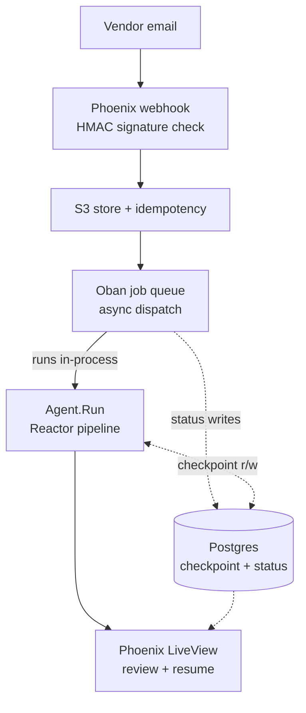
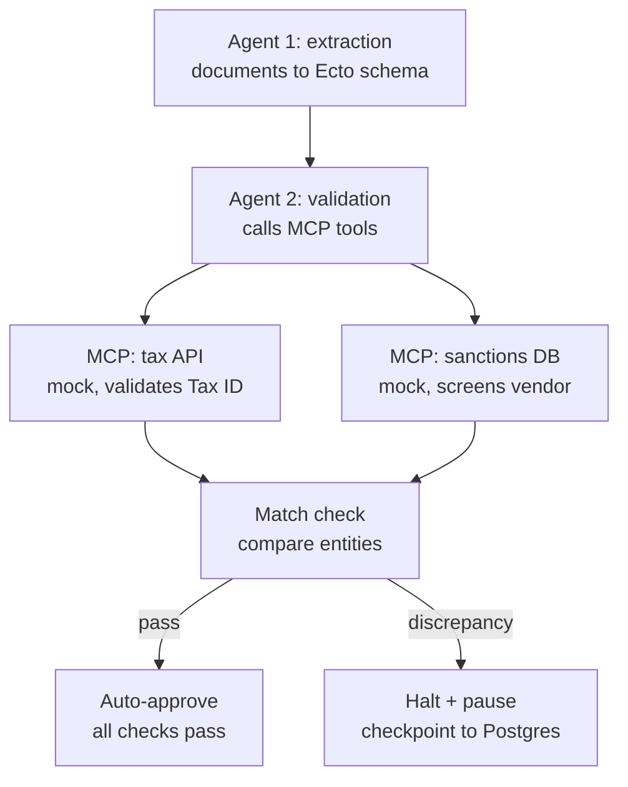
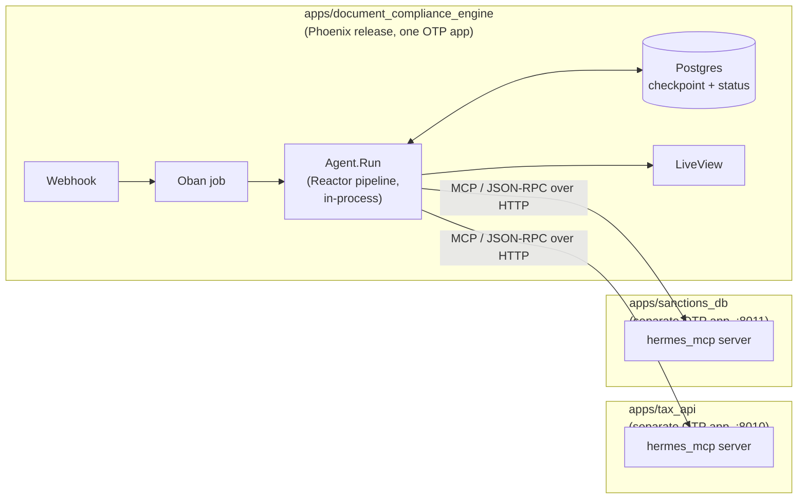

# Agentic Document Compliance Engine

A back-office automation system that ingests a document bundle, extracts structured data with an LLM, cross-validates it against external systems via MCP tools, and routes discrepancies to a human reviewer — with a durable, resumable pause instead of a dropped thread. Started as a vendor-onboarding-specific pipeline (a contract + a W-9); the ingestion data model has since been generalized to configurable document types (`DocumentTypes`, see Status below), though the one type the agent pipeline actually implements today is still that original contract-plus-W9 bundle.

## The business problem

Vendor onboarding is a high-volume, compliance-sensitive back-office process: someone has to read a contract and a tax form, key the data into a system, check the Tax ID against a government registry, screen the vendor against a sanctions list, and catch it when the name on the tax form doesn't match the name on the contract. Two common approaches both fall short. Doing it manually is slow and error-prone. Doing it with a naive LLM pipeline is fast, but trades that error-proneness for something worse: no audit trail, no way to prove it isn't hallucinating tax IDs, and no resumable path when something needs a human — it's fast right up until it's confidently wrong in a way nobody can catch or recover from.

This project builds the middle ground: an agentic pipeline that automates the extraction and validation, but treats every extracted fact as something that must be checked against a source before it acts on it, and treats every ambiguous case as something that must stop and wait for a person — durably.

## Architecture

**System overview** — one Phoenix release: Oban's job process is the async
boundary between the web/LiveView side and the agent pipeline (a plain
module tree, not a separate service), Postgres is the shared source of
truth for both status and workflow checkpoints:



**Agent workflow detail** — what runs inside `DocumentComplianceEngine.Agent.Run` on each trigger:



**Deployment topology** — three OTP applications, not four and not one. The
agent brain lives *inside* the Phoenix release (see "why this shape" below);
the two mock tools stay genuinely separate processes, because faking that
boundary away would make the MCP framing decorative rather than real. All
three live as equal siblings under `apps/` (a Mix umbrella for directory
clarity only — each keeps its own deps/build/config, see Local development):



### Why this shape, specifically

- **Phoenix does not run the agent pipeline on the request process.** A webhook handler blocking on a multi-minute agent run is a request-timeout waiting to happen. Phoenix enqueues an Oban job; the job process runs the pipeline to completion and writes the result back — Oban's own supervision is what keeps a pipeline crash from ever touching the web/LiveView side, no separate deployable required for that isolation. (An earlier pass built the agent brain as a genuinely separate OTP application talking over HTTP; collapsed back into one release once it was clear the HTTP hop was only buying independent-deploy/scale properties this project doesn't need — see `CONTEXT.md`'s dated entries.)
- **The HITL pause is backed by a Postgres-persisted checkpoint**, not in-memory state. If the app restarts mid-review, the paused workflow survives — verified by killing and restarting the whole node with a paused case in flight, not assumed. The `thread_id` for a paused run is stored on the `agent_runs` row so a human approving in LiveView can trigger a resume. The checkpoint table lives in its own Postgres schema (`agent_checkpoints`), owned by its own migration prefix rather than mixed into the business-domain tables, even though it shares the same Ecto Repo now.
- **MCP is used deliberately, not decoratively.** The mock Tax API and mock Sanctions DB are two real, separate OTP applications each exposing an MCP tool interface over HTTP, not two functions folded into one process — because MCP's value is standardizing tool access across processes, and the README should be honest that for exactly two fixed mock tools, plain function-calling would work identically. The MCP framing is there because it's the pattern that scales to N real tools, and that's the argument to make explicit, not assume.
- **Idempotency and PII are first-class, not afterthoughts.** The webhook computes an idempotency key (hash of raw payload) so a duplicated vendor email doesn't double-process a contract. Extracted Tax IDs and other PII get encrypted at rest and access-controlled storage — noted explicitly, since a project whose pitch is "compliance" loses credibility if its own data handling is naive.
- **The webhook is signature-verified, not just idempotency-checked.** `POST /webhooks/vendor_onboarding` requires an `x-webhook-signature: sha256=<hex>` header — an HMAC-SHA256 over the exact raw body bytes, checked with a constant-time compare (`DocumentComplianceEngineWeb.Plugs.VerifyWebhookSignature`). Idempotency alone stops duplicate processing of a *legitimate* payload; it does nothing to stop an unauthenticated caller from injecting a fabricated one, which is the actual threat model for an internet-facing ingestion endpoint on a compliance-pitched system. (The route path itself stays `/webhooks/vendor_onboarding` — it names the one ingestion flow that exists today, not the app; see `CONTEXT.md`'s dated entry on the app rename for why that's deliberately out of scope.)

## Evaluation

The core resume claim — "0% hallucination rate on extracted entities" — is only credible if it's backed by the right kind of check. This project uses a **two-tier eval**, not LLM-as-judge for everything:

1. **Deterministic checks** (no LLM, fast, free): does the extracted Tax ID exist verbatim in the source document text? Does the model's output validate against the extraction schema's changeset? These produce the hallucination-rate number.
2. **LLM-as-judge checks** (for genuinely ambiguous judgment): does the entity mapping in the extraction hold up under formatting differences ("J. Smith" vs "John Smith")? Is the agent's drafted mismatch explanation actually grounded in the real discrepancy? The judge model (Claude Sonnet) is a different provider than the agent model (GPT-4o-mini), to avoid self-grading inflation.

**Synthetic test set (20 documents), structured deliberately:**

| Bucket | Count | Tests |
|---|---|---|
| Clean, should auto-approve | 10 | happy path |
| Genuine name/entity mismatch | 5 | true-positive flagging |
| Subtle formatting difference, not a real mismatch | 3 | false-positive rate — the detail that makes "100% accuracy" credible rather than cherry-picked |
| Missing/malformed fields | 2 | graceful degradation |

Results are written up as a short metrics table in this README once the harness runs for real (with both `OPENAI_API_KEY` and `ANTHROPIC_API_KEY` configured), not just asserted. See `apps/document_compliance_engine/lib/document_compliance_engine/agent/evals/` and the Status section below for where that stands.

## Tech stack

- **Elixir / Phoenix / LiveView** — webhook ingestion, Oban job orchestration, human review UI, PubSub status updates, and the agent pipeline itself — one release
- **Ecto / PostgreSQL** — the `document_jobs`/`agent_runs`/`document_types` tables, plus the agent pipeline's checkpoint table (same Repo, separate Postgres schema via a migration prefix)
- **Bandit** — the Phoenix endpoint, and the transport for both MCP tool servers
- **Reactor** — the agent pipeline as dependency-resolved steps, with `{:halt, …}` + a persisted checkpoint for the durable HITL pause
- **Instructor** — structured LLM output into Ecto embedded schemas (Company Name, Tax ID; Payment Terms and Liability Clauses free text, LLM-judge validated)
- **MCP** (`hermes_mcp` servers, JSON-RPC-over-HTTP client on Req) — two mock tool servers (Tax API, Sanctions DB), each a real separate OTP application, consumed by the validation agent
- **Eval harness** (`mix eval.run`) — two-tier evaluation (deterministic + LLM-as-judge; agents on GPT-4o-mini, judge on Claude Sonnet via the Anthropic Messages API)
- **GitHub Actions** (`.github/workflows/ci.yml`) — `mix precommit` on every push/PR for the Phoenix app plus each of the two MCP server apps (`mix dialyzer` deliberately left out for now — see Status)

## Status

Build order steps 1–7 complete. The step-by-step entries below are a dated build log: steps 4–7 and the two hardening passes describe the Python/LangGraph implementation as it stood at the time, which the all-Elixir migration (last entry in this section) later replaced component-for-component. They're kept as history rather than rewritten.

- Step 1: `vendor_onboarding` Ecto schema + migrations, Cloak-encrypted Tax ID column, Oban wired into the supervision tree, the repository/context layering from `PRINCIPLES.md`.
- Step 2: webhook ingestion end to end — idempotency-key hashing off the raw request body, a config-swappable document storage boundary (local disk for dev/test), the `IngestWebhook` action, and a stub Oban job enqueue, all reachable via `POST /webhooks/vendor_onboarding`.
- Step 3: the full async round trip — `TriggerAgentRunWorker` calls the Python service via the new `Req`-based `AgentService` client, and the `agent_service/` FastAPI app calls back into `POST /webhooks/agent_callback`, which writes status back and broadcasts PubSub. Verified manually end to end (`received` → `processing` → `approved`), not just in tests.
- Step 4: a real LangGraph graph with Agent 1 (extraction) and the Postgres checkpointer (`app/checkpointer.py`), in its own `langgraph` schema.
- Step 5: Agent 1 now extracts the contract and W-9 **separately** (`ContractExtraction` / `W9Extraction`) so Agent 2 has two independent company names to cross-check — not one merged extraction with nothing to compare. Agent 2 calls two real, separate MCP tool servers (`mcp_servers/tax_api/`, `mcp_servers/sanctions_db/`, each its own FastAPI + `MCPServer` process talking real MCP-over-HTTP) plus an LLM-based entity-match judgment (not string equality, so formatting differences like "Corp" vs "Corporation" don't false-positive). On a discrepancy, the graph drafts an explanation and calls `interrupt()` — checkpointed to Postgres, carrying a `thread_id` back to Phoenix via the `needs_review` callback. **Verified for real**: the interrupt/resume round trip was run across two separate Python processes (simulating a restart) against the live local Postgres instance, and it resumed correctly — the durable-pause claim this project is built around.
- Step 6: `DashboardLive` (`/onboardings`) lists every onboarding with a live status badge, PubSub-driven — a callback landing anywhere reloads just that row, not the whole list. `ReviewLive` (`/onboardings/:id`) shows the side-by-side contract-vs-W-9 diff (the headline name-mismatch scenario) plus the agent's drafted explanation, with Approve/Reject buttons that call `AgentRuns.resume_review/2` → `AgentService.resume/1` → the Python `/resume` endpoint built in step 5. Resume doesn't write status locally — the Python callback stays the single writer of final status. Verified in a real running server (no headless-browser tool available in this environment, so verified via the actual HTTP responses + Phoenix logs rather than a screenshot): both pages render correctly against a live `needs_review` row with no errors in the logs.
- Step 7: the 20 synthetic documents (`agent_service/evals/fixtures.py`) in the exact 10/5/3/2 split from the table above, and the two-tier harness (`agent_service/evals/`) — deterministic Tax-ID-verbatim checks plus a DeepEval `GEval` judge tier (Claude Sonnet) for entity-mapping correctness and explanation groundedness, called directly against the LangGraph graph, bypassing Phoenix. **Not yet run for real** — this environment has neither `OPENAI_API_KEY` nor `ANTHROPIC_API_KEY`, so the harness's own plumbing is proven with an injected fake agent (which hits the correct expected decision on all 20/20 fixtures — see `tests/evals_tests/test_run.py`) rather than an actual accuracy number. The metrics table above stays a placeholder until someone runs `cd agent_service && uv run python -m evals.run` with real keys.

**Elixir domain refactor (post step-7):** the Elixir side was originally one context (`VendorOnboarding`) over one table. Split into two — `Onboardings` (the ingestion record + aggregate status, table `onboardings`) and `AgentRuns` (one row per agent run, table `agent_runs`, `belongs_to :vendor_onboarding`) — so re-runs keep history instead of overwriting the same columns, and so a real context boundary exists (neither queries the other's schema, only its public API; the dashboard's cross-context read is batched via `AgentRuns.latest_by_onboarding_ids/1`, not N+1). See `PRINCIPLES.md` §1 for the full rationale and the cross-context rules this introduced. Verified against a live running server, including the exact scenario the split was for: an Oban retry landing after a manual callback produced four real `agent_runs` history rows for one onboarding, with the callback correctly resolving to the latest.

**Python hardening pass (post refactor):** a from-scratch critical read of `agent_service/` turned up three real issues, all fixed and verified live: (1) `send_callback` used a blocking sync `httpx.post` inside `async def` functions, stalling the whole event loop for every callback — now `httpx.AsyncClient`; (2) a failed graph invocation (e.g. the missing-`OPENAI_API_KEY` case we'd already hit) had no error handling at all — the exception died silently inside the FastAPI background task and Phoenix never heard back, leaving the row stuck in `:processing` forever with zero signal. Now every failure path sends a `"status": "failed"` callback with the error message, logged server-side too — verified live, same missing-key scenario now correctly lands as `:failed` with a real explanation instead of hanging; (3) the Postgres schema-creation check ran a blocking sync connection on *every single* `/trigger`/`/resume` call — now async and memoized to a real no-op after the first call per process. `:failed` is now a valid status on both `Onboarding` and `AgentRun` (no migration needed — plain `:string` column, Ecto-layer enum only), with its own red badge in the dashboard rather than falling through to neutral.

**Python consistency pass:** the two MCP tool calls (`validate_tax_id`/`screen_vendor`) returned bare `dict`s while every LLM output was already a typed Pydantic model — inconsistent, and a typo in a dict key would've failed silently. Now `TaxValidationResult`/`SanctionsScreeningResult` (`app/schemas.py`), with `mcp_client.py` parsing into them at the boundary. The outbound callback to Phoenix was an ad-hoc dict too — now a `CallbackPayload` model, dumped with `exclude_none=True` to preserve the existing "only send the keys that actually have a value" behavior (an explicit `null` would otherwise overwrite a real value already on the row, e.g. a `thread_id` from an earlier run). `/trigger` and `/resume` now declare a real `AcceptedResponse` return type instead of bare `dict`, so FastAPI generates an actual OpenAPI response schema. Minor: the default LLM client is now `@lru_cache`d instead of rebuilt on every single call, and `evals/run.py` runs its 20 fixtures concurrently (capped at 5 at a time, not unbounded — rate limits are a real concern once this runs against a real account) instead of one at a time.

Also added `dialyzer` (wasn't set up at all) — caught a real gap: neither Ecto schema declared `@type t`, so every `@spec` referencing `Onboarding.t()`/`AgentRun.t()` across both repositories and three actions pointed at an undefined type. Fixed; `mix dialyzer` now runs clean and is documented in `CLAUDE.md` as a separate check (not folded into `precommit`, since the first PLT build is slow).

**All-Elixir migration:** the Python/FastAPI + LangGraph service and both Python MCP tool servers were replaced with three Elixir/OTP applications (`agent_service`, `mcp_servers/tax_api`, `mcp_servers/sanctions_db`). The wire contract is unchanged — same `/trigger` and `/resume` shapes, same callback payload — so the Phoenix app's `lib/` needed no code changes at all. Component swaps: Pydantic → Ecto embedded schemas via `instructor`; LangGraph's `StateGraph`/`interrupt()` → [Reactor](https://github.com/ash-project/reactor)'s halt/resume; LangGraph's Postgres checkpointer → one Ecto table in this service's own `agent_checkpoints` schema with its own migrations (same stack-decoupling rule, now between two Elixir apps); DeepEval's `GEval` → a hand-rolled judge calling Anthropic's Messages API directly, scoring the same two criteria and keeping the cross-provider anti-self-grading property.

Three findings worth recording, each verified rather than assumed:

1. **Reactor's `{:halt, value}` is not LangGraph's `interrupt()`.** A halted step is *finished* — its halt value is cached permanently and it never re-executes on resume. So the human's decision cannot be read by the step that halts; it must land in a downstream step that hasn't run yet. Hence the `:gate` (halts) / `:finalize` (consumes the decision) split in `onboarding_reactor.ex`. Collapsing those two would silently return the stale halt value instead of the reviewer's decision — a bug that type-checks and compiles fine. Resume also requires *all* original inputs re-supplied, which is why the checkpoint row stores them alongside the serialized reactor.
2. **The durable-pause claim was re-verified end to end**, not inherited: a halted reactor survives `:erlang.term_to_binary/1` → a genuinely separate BEAM instance → `binary_to_term` → resume, with the fresh human decision reaching the post-halt step. Completed steps do *not* re-run, so resuming costs no repeated LLM calls.
3. **The restart-survives-a-pause claim was re-verified live**, not just in the ExUnit round-trip: all four applications running as real separate OS processes, a webhook mismatch case paused with a checkpoint persisted to Postgres, the `agent_service` BEAM process killed outright (`kill -9`, not a graceful stop) and restarted as a fresh process with no in-memory state, then resumed via `POST /resume` against that new process. The human's decision (`rejected`) landed correctly on the Phoenix `onboardings`/`agent_runs` rows and the checkpoint was marked `resumed` — the same guarantee the original LangGraph checkpointer made, now proven under the new implementation rather than assumed to carry over.
4. **`hermes_mcp`'s client is unusable on current dependencies**: it passes `transport_opts` as a per-request Finch option, which Finch ≥ 0.21 rejects outright, and the only Req old enough to hold Finch back (0.5.17) has published CVEs. Rather than adopt a vulnerable dependency, the two tool servers remain real `hermes_mcp` servers (server side is Plug/Bandit, unaffected) and the agent talks to them with a small JSON-RPC-over-HTTP client on current Req — MCP's streamable-HTTP transport being `initialize` → `notifications/initialized` → `tools/call`, confirmed by curl against the running servers before it was written. The "two real, separate MCP servers" claim stays literally true.

**Collapsed `agent_service` back into one release**, same day as the migration above. Discussed the four-application shape directly: OTP already isolates a crashing process from the rest of its own release, so the HTTP boundary between Phoenix and `agent_service` was only buying independent-deploy/independent-scale properties, at the cost of an HTTP hop, an extra process to run, and (discovered in the process) two Ecto Repos silently sharing one `public.schema_migrations` table across two codebases pointed at the same physical database. Moved `agent_service/lib` into `lib/vendor_onboarding/agent/` as a plain module tree, replaced the HTTP trigger/resume/callback round trip with Oban's job process (already off the web/LiveView process) calling the pipeline directly and reporting through `AgentRuns.handle_agent_callback/1` in-process, and relocated the two MCP tool servers to a top-level `mcp_servers/` — they stay genuinely separate deployables since they're external tools, not the agent brain. One real, observable behavior change: `trigger_agent_run/1` now blocks until the whole pipeline finishes, so the onboarding is at its *final* status by the time it returns rather than still `:processing` — tests were updated to match, not preserved incorrectly. Full details in `CONTEXT.md`'s second dated entry.

**2026-08-14 hardening pass:** a from-scratch critical read of the post-collapse system turned up three real gaps, all fixed:

1. **The webhook endpoint had no authentication.** Idempotency and Tax ID encryption were already covered, but `POST /webhooks/vendor_onboarding` accepted any POST body from anyone who found the URL — a real hole for a system whose pitch is compliance. Added `VendorOnboardingWeb.Plugs.VerifyWebhookSignature`: an HMAC-SHA256 signature (`x-webhook-signature: sha256=<hex>`) over the exact raw body bytes, checked with `Plug.Crypto.secure_compare/2`. The signing secret is `WEBHOOK_SECRET` in prod (required, same pattern as `CLOAK_KEY` — raises on boot if missing), a fixed dev-only value in `config/dev.exs`, and a fixed test-only value backing a `sign_webhook_body/1` test helper in `ConnCase`.
2. **No CI.** `mix precommit` and `mix dialyzer` only ran locally — nothing enforced them on push. Added `.github/workflows/ci.yml`: one job runs `mix precommit` for the Phoenix app against a real Postgres service container, a second (matrix) job runs `mix precommit` for each MCP server. (Both jobs' paths were later updated to `apps/vendor_onboarding`, `apps/tax_api`, `apps/sanctions_db` by the umbrella restructuring below.) `mix dialyzer` is deliberately *not* wired into CI yet — running it while building this workflow surfaced 4 pre-existing errors (`lib/mix/tasks/eval.run.ex`, `agent/evals/run.ex`, `agent/run.ex`) unrelated to this pass; fixing those is separate follow-up work, not something to bundle silently into a CI-plumbing change.
3. **Oban's retry policy on the `agent_runs` queue wasn't tuned for the checkpoint-collision risk this project itself documents** (a retry replays the whole pipeline and can hit the checkpoint's unique `thread_id` constraint on a halt — see the "Agent-brain gotchas" section of `CLAUDE.md`). Both `TriggerAgentRunWorker` and `ResumeAgentRunWorker` were already capped below Oban's default of 20; lowered further to `max_attempts: 3` so a transient failure burns at most three full re-extractions instead of five.

**2026-08-15 umbrella restructuring:** the repo root became a Mix umbrella (`apps_path: "apps"`) so the three applications are visually equal siblings — `apps/vendor_onboarding/`, `apps/tax_api/`, `apps/sanctions_db/` — instead of `mcp_servers/tax_api` and `mcp_servers/sanctions_db` nesting under a top-level directory that happened to share its name with the Phoenix app, which was genuinely ambiguous at a glance despite the Mix-project boundary underneath always being real. Deliberately **not** a standard shared-dependency umbrella: each app's `mix.exs` sets its own `build_path`/`config_path`/`deps_path`/`lockfile` pointing at itself, preserving the independently-buildable/deployable property `CLAUDE.md` already documented for the two MCP servers. Confirmed by running `mix precommit` inside each of the three directories independently — same 88 + 3 + 3 tests passing as before the move. One real gotcha worth recording: running any `mix` command from the umbrella *root* (rather than `cd`-ing into an app first) still triggers Mix's umbrella-wide combined dependency resolution regardless of the per-app path overrides — it fetched every app's deps into a stray root `deps/`/`_build/` and then tried to start all three OTP applications together in one BEAM node, which collided. Root-level commands are unsupported by design here; `.github/workflows/ci.yml` and this README's Local development section both always `cd` into the specific app first.

**2026-08-15 generalized to `DocumentJobs` + `DocumentTypes`:** the ingestion domain was hardcoded to one document bundle (a contract + a W-9) with no notion of "what kind of document is this." `Onboardings` (context, `onboardings` table, `Onboarding` schema) was renamed to `DocumentJobs` throughout — modules, files, function names, the `AgentRuns` foreign key (`vendor_onboarding_id` → `document_job_id`), LiveView routes (`/onboardings` → `/document_jobs`) — and a new `DocumentTypes` context (`document_types` table: `slug`, `name`, `extraction_schema`, `validation_rules`) was added as a config registry, with `document_jobs.document_type_slug` referencing it. `DashboardLive` gained a document-type filter. Scoped deliberately to the data model: the agent pipeline (`Extraction`, `Checks`, `OnboardingReactor` — still so named on purpose, see `CONTEXT.md`) still only implements the one document type the migration seeds (`vendor_contract_w9`); teaching it to actually vary extraction/validation by document type is separate, real work, not done here. Two bugs caught in the process, both detailed in `CONTEXT.md`'s dated entry: a schema/migration mismatch on the checkpoint table's `onboarding_id` column (caught by `mix compile --warnings-as-errors`, fixed before it ever reached a test), and two camelCase-fused identifiers (`OnboardingsTest`, `OnboardingsRepository`) that the word-boundary-safe rename regex correctly skipped for the wrong reason, caught by a second grep pass. `mix precommit` clean, 95 tests passing (88 prior + 7 new).

**2026-08-15 system health panel:** `DashboardLive` now shows a live operational snapshot — BEAM process count, Oban queue depth, active agent run count, and an HTTP reachability check against each MCP server — via a new `VendorOnboarding.SystemHealth` module (not a context; it reads Oban's own job table directly, since that table belongs to neither `DocumentJobs` nor `AgentRuns`, and goes through `AgentRuns.count_active/0` for the one domain figure it needs). Refreshes every 5 seconds. The MCP health check hits each server's bare root rather than `/mcp`, so it doesn't need to speak real MCP JSON-RPC just to prove the process is up. See `CONTEXT.md`'s dated entry for the full rationale.

**2026-08-15 fixed the dead-end root path:** `/` and the navbar were still the unmodified `mix phx.new` scaffold — a Phoenix marketing landing page and links to phoenixframework.org, with nothing pointing at `/document_jobs`. `PageController.home/2` now redirects to `/document_jobs`; the navbar links there from every page. Verified against a real running server (curled both routes), not just the test suite. See `CONTEXT.md`'s dated entry.

**2026-08-15 renamed the app itself, `VendorOnboarding` → `DocumentComplianceEngine`:** the data-model generalization above (`Onboardings` → `DocumentJobs` + `DocumentTypes`) only renamed the ingestion context — the OTP app (`:vendor_onboarding`), the Elixir module namespace (`VendorOnboarding.*`/`VendorOnboardingWeb.*`), the `apps/vendor_onboarding/` directory, and the dev/test databases were all still the original vendor-onboarding-specific name. Renamed all of it — app atom to `:document_compliance_engine`, every module to `DocumentComplianceEngine.*`/`DocumentComplianceEngineWeb.*`, the directory to `apps/document_compliance_engine/`, the databases to `document_compliance_engine_dev`/`_test`, plus the navbar text, page title, and this README's own title. The webhook route path (`/webhooks/vendor_onboarding`) and `OnboardingReactor` were deliberately left alone — see `CONTEXT.md`'s dated entry for why. One real mistake caught mid-pass: the blanket rename swept `priv/repo/migrations/*.exs` too, corrupting literal historical SQL identifier strings in already-applied migrations (e.g. turning the real Postgres index name `agent_runs_vendor_onboarding_id_index` into a nonexistent `agent_runs_document_compliance_engine_id_index`) — migrations describe what was actually run and should never be retroactively edited, the same discipline already applied during the `Onboardings` → `DocumentJobs` rename. Caught before it reached a test, restored from the last commit, both databases dropped and recreated clean. `mix precommit` clean, same 100 tests.

100 Elixir tests in the Phoenix app (control plane + agent pipeline, one suite now) + 6 across the two MCP servers, `mix precommit` clean in each of the three apps independently. Every LLM call (both extractions, entity-match, explanation-drafting, and the judge) is built against GPT-4o-mini / Claude Sonnet but is dependency-injected — there's no `OPENAI_API_KEY` or `ANTHROPIC_API_KEY` configured in this dev environment yet, so all of the above is verified with injected fake LLM calls plus the two *real* MCP servers and the *real* Postgres checkpointer, not a live model call. See `CONTEXT.md` for the full build plan and architectural decisions.

## Local development

The repo root is a Mix umbrella (`apps/document_compliance_engine`, `apps/tax_api`,
`apps/sanctions_db`) for directory clarity only — each app is fully
independent (own deps, own build, own config). **Always `cd` into the
specific app first; never run `mix` commands from the repo root** — see
`CLAUDE.md`'s "Architecture in one paragraph" for why a root-level command
doesn't do what you'd expect here.

* `cd apps/document_compliance_engine && mix setup` to install dependencies and run migrations (includes the agent pipeline's checkpoint table, in its own `agent_checkpoints` schema)
* Set `OPENAI_API_KEY` (agents) and `ANTHROPIC_API_KEY` (LLM judge) in your environment to run the real LLM calls (neither is required to run the test suite — it uses injected fakes)
* Start Phoenix with `mix phx.server` or inside IEx with `iex -S mix phx.server` (from `apps/document_compliance_engine`)
* Visit [`localhost:4000`](http://localhost:4000)
* Webhook requests must be HMAC-SHA256 signed (`x-webhook-signature: sha256=<hex>` over the raw body). Dev uses the fixed secret in `apps/document_compliance_engine/config/dev.exs`; sign a local curl request with:
  ```sh
  BODY='{"contract":"...","w9":"..."}'
  SIG=$(printf '%s' "$BODY" | openssl dgst -sha256 -hmac "dev-only-webhook-secret-change-me" | sed 's/^.* //')
  curl -X POST localhost:4000/webhooks/vendor_onboarding \
    -H "content-type: application/json" -H "x-webhook-signature: sha256=$SIG" -d "$BODY"
  ```

The two mock MCP tool servers are still separate OTP applications — genuinely external tools, not part of the agent pipeline — and run alongside Phoenix during local development:

* `cd apps/tax_api && mix deps.get && iex -S mix` — mock Tax API MCP server, port 8010
* `cd apps/sanctions_db && mix deps.get && iex -S mix` — mock Sanctions DB MCP server, port 8011
* `mix test` from inside each app's own directory (likewise `cd apps/tax_api && mix test`, etc.)
* `mix eval.run` (from `apps/document_compliance_engine`) — the eval harness; the deterministic tier needs `OPENAI_API_KEY` (+ the two MCP servers running), the LLM-judge tier also needs `ANTHROPIC_API_KEY`
