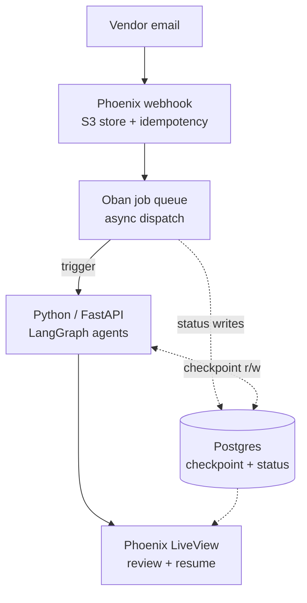
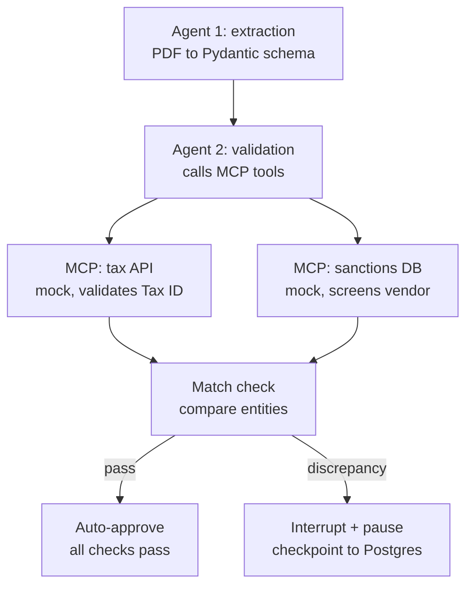

# Agentic Vendor Onboarding & Compliance Pipeline

A back-office automation system that ingests a new vendor's contract and W-9 tax form, extracts structured data with an LLM, cross-validates it against external systems via MCP tools, and routes discrepancies to a human reviewer — with a durable, resumable pause instead of a dropped thread.

## The business problem

Vendor onboarding is a high-volume, compliance-sensitive back-office process: someone has to read a contract and a tax form, key the data into a system, check the Tax ID against a government registry, screen the vendor against a sanctions list, and catch it when the name on the tax form doesn't match the name on the contract. Done manually, this is slow and error-prone. Done with a naive LLM pipeline, it's fast but unaccountable — no audit trail, no way to prove it isn't hallucinating tax IDs, no resumable path when something needs a human.

This project builds the middle ground: an agentic pipeline that automates the extraction and validation, but treats every extracted fact as something that must be checked against a source before it acts on it, and treats every ambiguous case as something that must stop and wait for a person — durably.

## Architecture

**System overview** — Elixir/Phoenix as the durable control plane, Python/LangGraph as the stateless-per-call agent brain, Postgres as the shared source of truth for both status and workflow checkpoints:

**Agent workflow detail** — what runs inside the Python/LangGraph service on each trigger:

### Why this shape, specifically

- **Phoenix does not call LangGraph synchronously.** A webhook handler blocking on a multi-minute agent run is a request-timeout waiting to happen. Phoenix enqueues an Oban job, which makes an async call to the Python service; the Python service calls back into a Phoenix webhook endpoint (or emits to a queue Phoenix consumes) when done.
- **The HITL pause is backed by a Postgres-persisted LangGraph checkpointer**, not in-memory state. If the Python process restarts mid-review, the paused workflow survives. The `thread_id` for a paused run is stored on the Elixir side (`vendor_onboarding` row) so a human approving in LiveView can trigger a resume call back into Python. The checkpointer's Postgres schema is owned and migrated by LangGraph's own setup, kept separate from Ecto's migrations, so the two stacks can evolve independently.
- **MCP is used deliberately, not decoratively.** The mock Tax API and mock Sanctions DB are two real, separate FastAPI processes each exposing an MCP tool interface, not two functions folded into one process — because MCP's value is standardizing tool access across processes, and the README should be honest that for exactly two fixed mock tools, plain function-calling would work identically. The MCP framing is there because it's the pattern that scales to N real tools, and that's the argument to make explicit, not assume.
- **Idempotency and PII are first-class, not afterthoughts.** The webhook computes an idempotency key (hash of raw payload) so a duplicated vendor email doesn't double-process a contract. Extracted Tax IDs and other PII get encrypted at rest and access-controlled storage — noted explicitly, since a project whose pitch is "compliance" loses credibility if its own data handling is naive.

## Evaluation

The core resume claim — "0% hallucination rate on extracted entities" — is only credible if it's backed by the right kind of check. This project uses a **two-tier eval**, not LLM-as-judge for everything:

1. **Deterministic checks** (no LLM, fast, free): does the extracted Tax ID exist verbatim in the source document text? Does the extracted JSON parse against the Pydantic schema? These produce the hallucination-rate number.
2. **LLM-as-judge checks** (DeepEval `GEval`, for genuinely ambiguous judgment): does the entity mapping in the extraction hold up under formatting differences ("J. Smith" vs "John Smith")? Is the agent's drafted mismatch explanation actually grounded in the real discrepancy? The judge model (Claude Sonnet) is a different provider than the agent model (GPT-4o-mini), to avoid self-grading inflation.

**Synthetic test set (20 documents), structured deliberately:**

| Bucket | Count | Tests |
|---|---|---|
| Clean, should auto-approve | 10 | happy path |
| Genuine name/entity mismatch | 5 | true-positive flagging |
| Subtle formatting difference, not a real mismatch | 3 | false-positive rate — the detail that makes "100% accuracy" credible rather than cherry-picked |
| Missing/malformed fields | 2 | graceful degradation |

Results are written up as a short metrics table in this README once the harness runs, not just asserted.

## Tech stack

- **Elixir / Phoenix / LiveView** — webhook ingestion, Oban job orchestration, human review UI, PubSub status updates
- **Ecto / PostgreSQL** — `vendor_onboarding` status table + LangGraph's Postgres checkpointer (same instance, separate schema, owned by LangGraph's own migrations)
- **Python / FastAPI** — service wrapping the LangGraph graph, exposes trigger + resume endpoints
- **LangGraph** — two-agent graph (extraction, validation), `interrupt` + Postgres checkpointer for durable HITL pause
- **Pydantic** — extraction schema (Company Name, Tax ID strictly typed; Payment Terms, Liability Clauses free text, LLM-judge validated)
- **MCP** — two mock tool servers (Tax API, Sanctions DB), each a real separate FastAPI process, consumed by the validation agent
- **DeepEval** — two-tier evaluation harness (deterministic + `GEval` LLM-as-judge; agents on GPT-4o-mini, judge on Claude Sonnet)

## Status

Build order steps 1–2 complete:

- Step 1: `vendor_onboarding` Ecto schema + migrations, Cloak-encrypted Tax ID column, Oban wired into the supervision tree, the repository/context layering from `PRINCIPLES.md`.
- Step 2: webhook ingestion end to end — idempotency-key hashing off the raw request body, a config-swappable document storage boundary (local disk for dev/test), the `IngestWebhook` action, and a stub Oban job enqueue, all reachable via `POST /webhooks/vendor_onboarding`.

29 tests passing, `mix precommit` clean. No agent service, no LiveView yet — the enqueued Oban job is still a stub (step 3 replaces it with a real call to the Python service). See `CONTEXT.md` for the full build plan and architectural decisions.

## Local development

* Run `mix setup` to install and setup dependencies
* Start Phoenix endpoint with `mix phx.server` or inside IEx with `iex -S mix phx.server`
* Visit [`localhost:4000`](http://localhost:4000)

The Python agent service (`agent_service/`, added in a later build step) runs as a separate process alongside Phoenix during local development.
